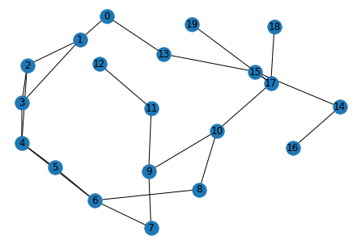

A graph is a set of vertices and edges that connect vertices.   Vertices and edges can be used to describe any graph.  In a highly connected world,  graphs data structures are essential as they provide a natural way to represent data elements and the dependencies between these elements. Many data can be represented as graphs,  social networks, transportation networks,  computer networks, brain networks, concepts in causal reasoning, neural networks,  programs structures , and so on.  Any dataset that has a kind of dependent relationship between its elements can be represented as a graph. Once we have our data in a graph, there is an independent field in mathematics called graph theory (or network science) that contains rich methods and  formalties that can be used to reason about our data. 


## Random Walk
A random walk on a graph is a way to explore graphs.  Basically, to explore a graph with a random walk, you start at a random vertex and randomly _walk_ on the graph.  Imagine a walk as a liquid you pour on a vertex and let the liquid diffuses to other vertices. Those _wet_ vertices are contained in the obtained walk. These walks are samples from the graph. As in statistics, you take a random sample from a population and use the sample to infer about the population; random walks can be seen as sampling from a graph. Similarly, the sample can be used to learn about the given graph.  

In this article, we will :
- Generate a random graph
- Explore the graph using Random Walks
- We will pretend that we know nothing about the _mother_ graph and construct a graph from the random walks we have.
- Do some data analysis to see how  we can obtain some graph metrics from the reconstructed graph (other data analysis will be followed in future articles)
 
For more on graphs /random walks, you have Google. Let us get our hands dirty and import the libraries we will use:

```python
import networkx as nx
import random
import pandas as pd
import seaborn as sns
import matplotlib.pyplot as plt
from tqdm import tqdm
%matplotlib inline
```

For generating random graphs, we will use the connected Watts–Strogatz model. The following function will return a small-world graph. 

```python
def gen_topo(nodes,connected_to_Xneighbors,p):
    n = nodes  
    m = connected_to_Xneighbors # e.g., each node initially connected to its m nearest neighbors
    g = nx.connected_watts_strogatz_graph(n,m,p) # These connections are randomly rewired with probability of p
    return g
```
Get to know our generated graph:


```python
g = gen_topo(20,4,0.1)
pos = nx.spring_layout(g)
nx.draw(g,pos,with_labels=True)
plt.show()
```

<p align="center">
  
</p>


The following step is to create a function that explores graphs using random walk and obtain _N_ random walks as follows:
```python
# get a single random walk
def Single_randomwalk(src_node, walk_length):
    random_walk = [src_node]
    for i in range(walk_length-1):
        temp = list(g.neighbors(src_node))
        temp = list(set(temp) - set(random_walk))    
        if len(temp) == 0:
            break
        random_node = random.choice(temp)
        random_walk.append(random_node)
        src_node = random_node
    return random_walk


# get a bunch of ranodm walks
def bunch_walks(graph_g, No_walks, Max_walk_len ,tqdm_disable ) :
    # get list of all nodes of the graph
    vertices = list(graph_g.nodes())
    random_walks = []
    No_of_walks = list(range(0, No_walks))
    for n in tqdm(No_of_walks,position=0, leave=True ,disable=tqdm_disable ): 
            Rand_Src_vertex= random.choice(vertices)
            random_walks.append(Single_randomwalk(Rand_Src_vertex, Max_walk_len)) 
            # Max_walk_len can be as big as the number of vertices in the graph
    return random_walks
```
Call the function above to get a bunch of random walks.

```python
random_walks= bunch_walks(g, 20, 10 ,tqdm_disable=False)
```

Just to be sure that we have differnt walks , we will classify the walks and see how many walks we have and their lengths:

```python
def Classify_Walks(Walks):
    Output = {}
    for L in Walks:
        Output.setdefault(len(L), list()).append(L)
    return Output
    
resulted_Dic = Classify_Walks(random_walks)
for key, value in resulted_Dic.items():
    print("Length :{},  Size :{}".format (key, len([item for item in value if item])))
```    
Length :10,  Size :16<br />
Length :9,  Size :2<br />
Length :6,  Size :2<br />

Time for the reconstruction . First we will create a function that gives us a dictionary of vertices and their connected vertices. Then we will use the information from the set of our random walks to recover what we can from the _mother_ graph.


```python

def get_neighbors(random_walks, all_nodes):
    Graph_dic = {key:[] for key in all_nodes}
    for i in range(len(all_nodes)):
        Current_node = all_nodes[i] # get the nodes one by one
        # We need to look for each node's neighbors 
        for j in range(0, len(random_walks)):
            j_walk = random_walks[j]
            for node in j_walk:
                if  Current_node in j_walk and Current_node!=node :
                    Node_index = j_walk.index(Current_node)# Get its index so that we can get its neighbors
                    # Check if the node is at the beggining or at the last of the walk, to avoid out of range indexing
                    temp_neighbors = []
                    if Node_index != 0 and Node_index != len(j_walk)-1 :
                        temp_neighbors.extend([j_walk[Node_index-1], j_walk[Node_index+1]])
                    elif Node_index == 0 :
                        temp_neighbors.append(j_walk[Node_index+1])
                    else:
                        temp_neighbors.append(j_walk[Node_index-1])
                        [Graph_dic[Current_node].append(vertex) for vertex in temp_neighbors if vertex not in Graph_dic.get(Current_node)]
  return Graph_dic
  
  def reconstruct_graph(dic):
    new_g= nx.Graph()
    g.add_nodes_from(dic.keys())
    for x, y in dic.items():
        new_g.add_edges_from(([(x, t) for t in y]))
    return new_g
```  
Assume we know nothing about the _mama graph_, no number of vertices, and no information about their identifiers.
All the information we can infer is from the random walks we have. 

```python
random_walks = bunch_walks(g, 20, 10 , tqdm_disable=False)
# we will get  vertices from the random walks 
Distnict_nodes = {x for l in random_walks for x in l}
Distnict_nodes = list(Distnict_nodes) 
graph_dic = get_neighbors(random_walks, Distnict_nodes)  
new_g = reconstruct_graph(graph_dic)  
nx.draw(new_g,pos, with_labels=True)
```

<p align="center">
  
</p>

We've just recovered the _mother_ graph from the random walks. What if we decreased the size of our random walks and the max length? 

```python
random_walks = bunch_walks(g, 8, 5 ,tqdm_disable=False)
# we will get  vertices from the random walks 
Distnict_nodes = {x for l in random_walks for x in l}
Distnict_nodes = list(Distnict_nodes)
graph_dic = get_neighbors(random_walks, Distnict_nodes)  
new_g = reconstruct_graph(graph_dic)  
nx.draw(new_g,pos,with_labels=True)
```

<p align="center">
  
</p>

As you can see, the information we can infer from these last two graphs is not the same. 

Let's vary the number of walks and their max length and compare them with the original graph.
The graph metrics we want to observe are average shortest distance and average degree.
These are some of the very robust metrics of any graph.

```python
No_walks = []
Max_walk_len = []
# Graph metric we want to observe 
Ave_degree = []
ASPL= []
for i in range(2000):
    Walks_size = random.randint(len(g.nodes)//4, len(g.nodes))
    Max_length = random.randint(3, len(g.nodes))
    random_walks = bunch_walks(g, Walks_size, Max_length,tqdm_disable=True)
    graph_dic = get_neighbors(random_walks, Distnict_nodes)  
    new_g = reconstruct_graph(graph_dic)
    if nx.is_connected(new_g) :
        Ave_degree.append(new_g.number_of_edges()/(len(new_g.nodes())))
        ASPL.append(nx.average_shortest_path_length(new_g))
        No_walks.append(Walks_size)
        Max_walk_len.append(Max_length)
# save  our data to a dataframe 
Metrics_df = pd.DataFrame(
    {'No_walks': No_walks,
     'Ave_degree': Ave_degree,
     'ASPL':ASPL,
     'Max_walk' :Max_walk_len
     
    })
Metrics_df.head()
  ``` 

Let us explore the data we have just obtained 


```python
fig, axs = plt.subplots(nrows=2, ncols=1, figsize=(12,10), sharex=True)
fig.subplots_adjust(hspace=0.01)
sns.boxplot(x="No_walks", y="ASPL",data=Metrics_df,ax= axs[0])
sns.stripplot(x="No_walks" ,y="ASPL" ,data=Metrics_df, jitter=True,alpha=0.3, edgecolor='gray', linewidth=1, ax= axs[0])
l1=axs[0].axhline(nx.average_shortest_path_length(g), linewidth=2.5, color='r', ls='--')
l1.set_label('ASPL(Orignal graph)')
axs[0].legend(loc='best')
axs[0].set_ylabel('ASPL')
#axs[0].set_xlabel('#Walks')
sns.boxplot(x="No_walks", y="Ave_degree", data=Metrics_df, ax= axs[1])
sns.stripplot(x="No_walks", y="Ave_degree" ,data=Metrics_df, jitter=True, alpha=0.3, edgecolor='gray', linewidth=1, ax=axs[1])
l2=axs[1].axhline((g.number_of_edges()/ (len(g.nodes()))), linewidth=2.5, color='r',ls='--')
l2.set_label('Ave. degree(Orignal graph)')
axs[1].legend(loc='best')
axs[1].set_ylabel('Average Degree')
axs[1].set_xlabel('#Walks')
fig.suptitle('#Walks vs. ASPL/Graph Average Degree', fontsize=15)
 ``` 
 <p align="center">
  
</p>

More walks, more accurecy . The same is true for maximum allowed length of a walk:
 <p align="center">
  
</p>

In the next article , we will try to contemplate this data more. 

Thanks a lot for your time!

Aiman Ghannami . : [LinkedIn](linkedin.com/in/aiman-ghannami-65b52669) - Email: aymen.omg@gmail.com 

	
